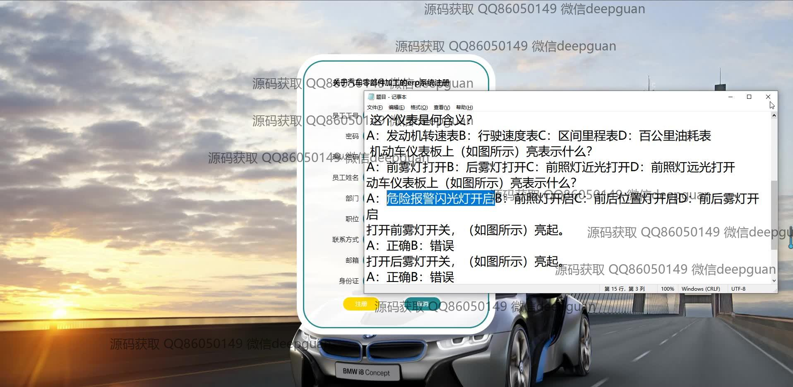
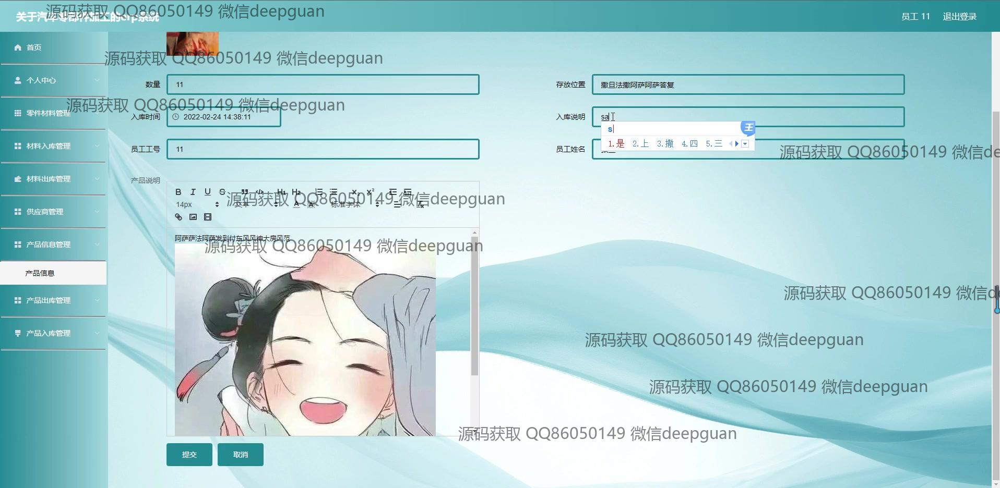

<h1 align="center">关于汽车零部件加工的erp系统</h1>

## 简介
汽车零部件加工ERP系统：角色分为管理员、员工、经理；支持功能包括员工管理、订单管理、库存控制、生产计划、产品信息管理和供应商管理，旨在优化资源配置与生产效率。    --计算机毕业设计源码；毕设源码；java毕业设计源码

## 联系方式

<h3 align="center">获取完整代码与数据库文件 + 微信：deepguan QQ: 86050149 QQ群: 783742310</h3>

<h3 align="center">可帮忙远程部署 包运行成功！提供远程部署、修改代码、设计文档指导、代码讲解等服务！</h3>

## 功能介绍（完整见运行截图）
管理员：管理系统模块，功能包括员工管理、部门管理、零件材料管理、库存管理、供应商管理等。可进行数据录入、修改、删除、查询和审核，支持查看入库、出库记录及生成相关统计报表，优化企业资源分配及流程管理。

经理：查看和管理生产计划、订单进度、库存状态和质量检测数据，审批员工和供应商的操作请求。通过生产计划模块安排任务，实时跟踪订单及库存信息，为决策提供数据支持。

员工：登录系统后，可操作个人中心模块，包括个人信息管理、密码修改、查看任务分配和操作记录。在零件材料管理中，支持物料入库、出库记录的录入和更新。

供应商：通过供应商管理模块录入企业信息，维护联系人、经营范围、供应产品等资料，与企业实现无缝对接，及时更新库存和物料供应信息，支持合作状态的实时更新和管理。

## 运行截图

本代码来源于网络,仅供学习参考使用!

